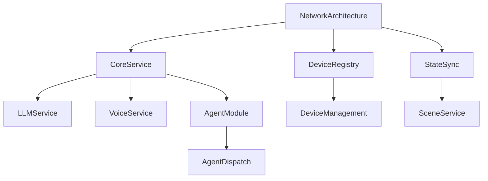

# 智能工业AI系统开发标准

## 1. 文档结构

```
standards/
├── core/                    # 核心标准
│   ├── NetworkArchitecture.md  # 网络架构标准
│   ├── CoreService.md         # 核心服务标准
│   └── SecurityPolicy.md      # 安全策略标准
├── devices/                 # 设备标准
│   ├── DeviceRegistry.md      # 设备注册标准
│   ├── StateSync.md          # 状态同步标准
│   └── DeviceManagement.md    # 设备管理标准
├── agents/                  # 代理标准
│   ├── AgentModule.md        # 代理模块标准
│   ├── AgentDispatch.md      # 代理调度标准
│   └── AgentDevelopment.md   # 代理开发标准
├── services/               # 服务标准
│   ├── LLMService.md         # LLM服务标准
│   ├── VoiceService.md       # 语音服务标准
│   └── SceneService.md       # 场景服务标准
└── README.md               # 本文档
```

## 2. 版本控制

当前版本：v1.0.0
最后更新：2024-02-12

### 版本历史
- v1.0.0 (2024-02-12): 初始版本，完成基础标准制定
- v0.9.0 (2024-02-07): 预发布版本，完成文档架构设计
- v0.8.0 (2024-02-06): 草稿版本，开始标准化工作

## 3. 术语表

### 3.1 系统术语
- **Core Service**: 核心服务，负责系统的基础功能和服务协调
- **Device Registry**: 设备注册服务，负责设备的注册和发现
- **State Sync**: 状态同步服务，负责设备状态的同步和管理
- **Agent**: 智能代理，负责特定功能的处理和决策

### 3.2 技术术语
- **LLM**: Large Language Model，大语言模型
- **VAD**: Voice Activity Detection，语音活动检测
- **TTS**: Text-to-Speech，文本转语音
- **ASR**: Automatic Speech Recognition，自动语音识别

### 3.3 命名规范
- 服务名称：使用PascalCase（如：DeviceRegistry）
- 配置项：使用UPPER_SNAKE_CASE（如：MAX_RETRY_COUNT）
- 变量名：使用snake_case（如：device_id）
- 类名：使用PascalCase（如：DeviceManager）
- 方法名：使用snake_case（如：register_device）

## 4. 依赖关系



## 5. 开发规范

### 5.1 代码风格
- 遵循PEP 8标准
- 使用类型注解
- 编写完整的文档字符串
- 保持代码简洁清晰

### 5.2 文档风格
- 使用Markdown格式
- 包含完整的示例代码
- 提供清晰的流程图
- 使用统一的文档结构

### 5.3 提交规范
- feat: 新功能
- fix: 修复bug
- docs: 文档更新
- style: 代码格式调整
- refactor: 代码重构
- test: 测试相关
- chore: 其他修改

## 6. 质量保证

### 6.1 代码审查
- 遵循四眼原则
- 使用代码审查清单
- 确保测试覆盖
- 验证文档更新

### 6.2 测试要求
- 单元测试覆盖率 > 80%
- 集成测试覆盖关键路径
- 性能测试达标
- 安全测试通过

## 7. 安全规范

### 7.1 基本原则
- 最小权限原则
- 数据加密传输
- 身份认证要求
- 日志审计要求

### 7.2 具体要求
- 使用TLS 1.3+
- 密码至少8位
- 令牌有效期1小时
- 关键操作需二次认证

## 8. 更新维护

### 8.1 文档更新
1. 提出更新建议
2. 评审讨论
3. 更新文档
4. 版本发布

### 8.2 标准演进
1. 收集反馈
2. 分析评估
3. 制定方案
4. 实施更新 