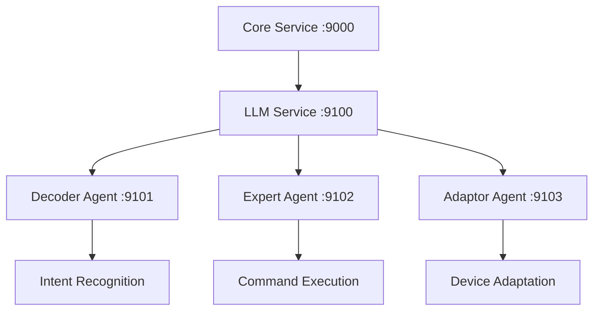

## 1. 智能代理架构

### 1.1 组件架构



### 1.2 服务端口

```python
# 智能代理端口
LLM_SERVICE_PORT = 9100      # LLM服务
DECODER_AGENT_PORT = 9101    # 解码代理
EXPERT_AGENT_PORT = 9102     # 专家代理
ADAPTOR_AGENT_PORT = 9103    # 适配代理
```

## 2. 代理通信协议

### 2.1 意图识别请求

```json
{
    "type": "decode_intent",
    "source": "core",
    "target": "decoder",
    "payload": {
        "text": "用户输入文本",
        "context": {
            "session_id": "xxx",
            "user_id": "xxx",
            "timestamp": "ISO8601"
        }
    }
}
```

### 2.2 意图识别响应

```json
{
    "success": true,
    "intent": {
        "type": "device_control",
        "device": {
            "id": "device_id",
            "name": "设备名称"
        },
        "action": "set_power",
        "parameters": {
            "power": true
        },
        "confidence": 0.95
    }
}
```

## 3. 代理实现规范

### 3.1 代理基类

```python
class BaseAgent:
    """代理基类"""
    
    def __init__(self, agent_id: str, port: int):
        self.agent_id = agent_id
        self.port = port
        self.server = None
        self.clients = {}
        
    async def start(self):
        """启动代理"""
        self.server = await asyncio.start_server(
            self.handle_request,
            'localhost',
            self.port
        )
        
    async def stop(self):
        """停止代理"""
        if self.server:
            self.server.close()
            await self.server.wait_closed()
            
    async def handle_request(
        self,
        reader: asyncio.StreamReader,
        writer: asyncio.StreamWriter
    ):
        """处理请求"""
        try:
            data = await reader.read(1024)
            message = json.loads(data.decode())
            response = await self.process_message(message)
            writer.write(json.dumps(response).encode())
            await writer.drain()
        finally:
            writer.close()
            await writer.wait_closed()
```

### 3.2 解码代理

```python
class DecoderAgent(BaseAgent):
    """解码代理"""
    
    def __init__(self, agent_id: str, llm_service: LLMService):
        super().__init__(agent_id, DECODER_AGENT_PORT)
        self.llm_service = llm_service
        
    async def decode_intent(self, text: str) -> Dict[str, Any]:
        """解码用户意图"""
        # 构建提示词
        prompt = self._build_prompt(text)
        
        # 调用LLM服务
        response = await self.llm_service.generate(prompt)
        
        # 解析响应
        return self._parse_response(response)
```

### 3.3 专家代理

```python
class ExpertAgent(BaseAgent):
    """专家代理"""
    
    def __init__(self, agent_id: str, llm_service: LLMService):
        super().__init__(agent_id, EXPERT_AGENT_PORT)
        self.llm_service = llm_service
        
    async def execute_intent(self, intent: Dict[str, Any]) -> bool:
        """执行意图"""
        # 验证意图
        if not self._validate_intent(intent):
            return False
            
        # 构建执行计划
        plan = await self._build_execution_plan(intent)
        
        # 执行计划
        return await self._execute_plan(plan)
```

## 4. 错误处理

### 4.1 错误类型

```python
class AgentError(Exception): pass
class IntentError(AgentError): pass
class ExecutionError(AgentError): pass
class CommunicationError(AgentError): pass
```

### 4.2 错误恢复

1. 意图识别失败
```python
async def decode_with_retry(self, text: str, max_retries: int = 3):
    """重试意图识别"""
    for i in range(max_retries):
        try:
            return await self.decode_intent(text)
        except IntentError:
            await asyncio.sleep(1 * (i + 1))
    return None
```

2. 执行失败
```python
async def execute_with_fallback(self, intent: Dict[str, Any]):
    """执行失败后的降级处理"""
    try:
        return await self.execute_intent(intent)
    except ExecutionError:
        return await self._execute_fallback_plan(intent)
```

## 5. 监控规范

### 5.1 代理指标

1. 基础指标
- 请求处理时间
- 响应成功率
- 错误率
- 并发连接数

2. 业务指标
- 意图识别准确率
- 执行成功率
- LLM调用次数
- 平均响应时间

### 5.2 日志规范

```python
{
    "timestamp": "ISO8601",
    "agent_id": "xxx",
    "event": "intent_decode|intent_execute|error",
    "level": "INFO|WARNING|ERROR",
    "message": "详细信息",
    "data": {
        "input": "xxx",
        "output": "xxx",
        "duration_ms": 100
    }
}
```

## 6. 测试规范

### 6.1 单元测试

```python
class TestDecoderAgent(unittest.TestCase):
    async def test_intent_recognition(self):
        """测试意图识别"""
        agent = DecoderAgent("test", mock_llm_service)
        intent = await agent.decode_intent("打开客厅的灯")
        self.assertEqual(intent["action"], "set_power")
        self.assertEqual(intent["parameters"]["power"], True)
        
    async def test_context_understanding(self):
        """测试上下文理解"""
        agent = DecoderAgent("test", mock_llm_service)
        context = {"location": "客厅"}
        intent = await agent.decode_intent("把温度调高一点", context)
        self.assertEqual(intent["action"], "set_temperature")
        self.assertTrue(intent["parameters"]["temperature"] > 0)
```

### 6.2 集成测试

```python
class TestAgentIntegration(unittest.TestCase):
    async def test_command_execution(self):
        """测试命令执行流程"""
        # 创建代理
        decoder = DecoderAgent("decoder", llm_service)
        expert = ExpertAgent("expert", llm_service)
        
        # 解码意图
        intent = await decoder.decode_intent("把客厅的温度调到26度")
        self.assertIsNotNone(intent)
        
        # 执行意图
        success = await expert.execute_intent(intent)
        self.assertTrue(success)
        
        # 验证结果
        device_state = await device_manager.get_device_state("ac001")
        self.assertEqual(device_state["temperature"], 26)
```

## 7. 安全规范

### 7.1 访问控制

1. 认证配置
```python
class AgentAuthConfig:
    """代理认证配置"""
    TOKEN_EXPIRATION = 3600  # 1小时
    MAX_FAILED_ATTEMPTS = 3
    LOCKOUT_DURATION = 300   # 5分钟
```

2. 权限检查
```python
async def check_permission(self, agent_id: str, action: str) -> bool:
    """检查代理权限"""
    # 获取代理角色
    role = await self._get_agent_role(agent_id)
    
    # 检查权限
    return self._check_role_permission(role, action)
```

### 7.2 数据安全

1. 敏感信息处理
```python
class DataSecurity:
    """数据安全处理"""
    
    def mask_sensitive_data(self, data: Dict[str, Any]) -> Dict[str, Any]:
        """脱敏处理"""
        pass
        
    def encrypt_sensitive_data(self, data: Dict[str, Any]) -> Dict[str, Any]:
        """加密处理"""
        pass
```

2. 安全配置
```python
class SecurityConfig:
    """安全配置"""
    ENCRYPTION_ALGORITHM = "AES-256-GCM"
    KEY_ROTATION_INTERVAL = 24 * 60 * 60  # 24小时
    MAX_TOKEN_AGE = 30 * 24 * 60 * 60    # 30天
    MIN_TLS_VERSION = "TLSv1.3"
```
