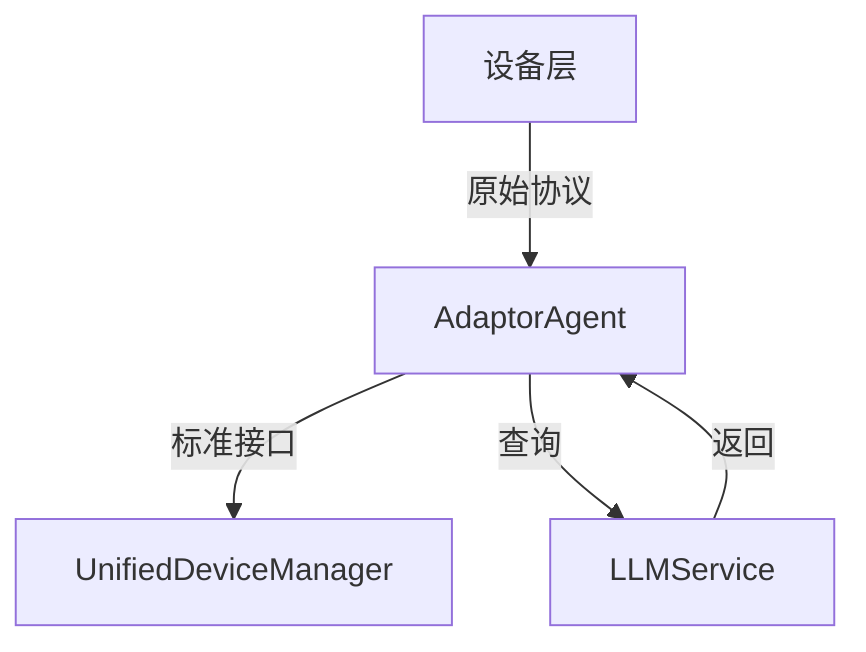

# 设备适配架构设计

**版本**: v1.0.0
**更新时间**: 2024-02-12
**状态**: Active

## 1. 架构概述

### 1.1 设计原则

1. **统一适配**
   - 所有设备适配通过 AdaptorAgent 集中处理
   - 确保适配逻辑的一致性和可维护性
   - 支持动态适配规则更新

2. **关注点分离**
   - 设备端：专注于原始功能实现
   - 适配层：专注于协议和数据转换
   - 系统端：专注于标准化管理

3. **可扩展性**
   - 支持动态添加新设备类型
   - 支持动态更新适配规则
   - 支持自定义适配策略

### 1.2 架构层次



## 2. 核心组件

### 2.1 AdaptorAgent

```python
class AdaptorAgent:
    """设备适配代理
    职责：
    1. 协议转换
    2. 数据标准化
    3. 功能映射
    4. 状态转换
    5. 错误处理
    """
```

#### 2.1.1 适配流程

1. **设备信息适配**
   ```mermaid
   sequenceDiagram
       Device->>AdaptorAgent: 原始设备信息
       AdaptorAgent->>LLMService: 请求适配建议
       LLMService-->>AdaptorAgent: 返回建议
       AdaptorAgent->>DeviceManager: 标准设备信息
   ```

2. **命令适配**
   ```mermaid
   sequenceDiagram
       System->>AdaptorAgent: 标准命令
       AdaptorAgent->>LLMService: 请求命令转换
       LLMService-->>AdaptorAgent: 返回转换结果
       AdaptorAgent->>Device: 设备特定命令
   ```

### 2.2 设备实现

设备实现应专注于提供原始功能，不需要考虑适配问题：

```python
class DeviceImplementation:
    """设备实现示例
    职责：
    1. 实现设备原始功能
    2. 提供原始接口
    3. 维护设备状态
    4. 处理底层通信
    """
```

## 3. 适配规范

### 3.1 设备描述规范

```json
{
    "device_type": "string",
    "manufacturer": "string",
    "model": "string",
    "protocol": {
        "type": "string",
        "version": "string"
    },
    "capabilities": [
        {
            "name": "string",
            "parameters": {
                "type": "string",
                "range": ["min", "max"],
                "enum": ["value1", "value2"]
            }
        }
    ]
}
```

### 3.2 标准接口规范

```python
class StandardInterface:
    """标准接口规范
    包含：
    1. 设备控制接口
    2. 状态查询接口
    3. 事件通知接口
    4. 配置管理接口
    """
```

## 4. 错误处理

### 4.1 错误类型

1. **适配错误**
   - 协议不兼容
   - 参数范围错误
   - 功能不支持

2. **执行错误**
   - 设备离线
   - 操作超时
   - 状态冲突

### 4.2 错误恢复

```python
async def handle_adaption_error(error: AdaptionError):
    """错误处理流程
    1. 记录错误信息
    2. 尝试自动恢复
    3. 通知相关组件
    4. 更新设备状态
    """
```

## 5. 测试规范

### 5.1 单元测试

```python
class AdaptionTest:
    """适配测试用例
    覆盖：
    1. 协议转换
    2. 参数映射
    3. 错误处理
    4. 边界条件
    """
```

### 5.2 集成测试

```python
class IntegrationTest:
    """集成测试用例
    验证：
    1. 端到端流程
    2. 性能指标
    3. 稳定性
    4. 并发处理
    """
```

## 6. 监控和维护

### 6.1 性能指标

1. **适配性能**
   - 响应时间
   - 成功率
   - 资源消耗

2. **系统健康**
   - 内存使用
   - CPU负载
   - 错误率

### 6.2 日志规范

```json
{
    "timestamp": "ISO8601",
    "level": "INFO|WARNING|ERROR",
    "component": "ADAPTOR|DEVICE|MANAGER",
    "event": "string",
    "details": {
        "device_id": "string",
        "operation": "string",
        "status": "string",
        "error": "string?"
    }
}
```

## 7. 版本历史

### v1.0.0 (2024-02-12)
- 初始版本
- 定义基本架构
- 确立核心组件
- 规范适配流程

## 8. 待办事项

- [ ] 实现动态适配规则更新
- [ ] 添加性能监控系统
- [ ] 完善错误恢复机制
- [ ] 扩展测试覆盖范围 