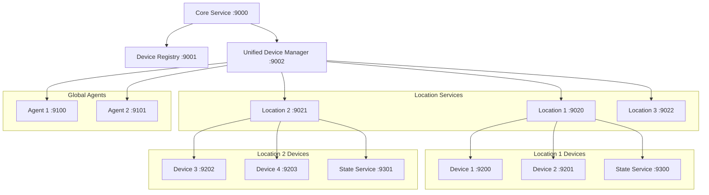

# 网络架构标准

**版本**: v1.2.0
**更新时间**: 2024-02-12
**相关文档**: 
- [核心服务标准](CoreService.md)
- [安全策略标准](SecurityPolicy.md)
- [错误码标准](ErrorCodes.md)
- [设备注册标准](../devices/DeviceRegistry.md)
- [状态同步标准](../devices/StateSync.md)

## 1. 网络架构设计

### 1.1 端口分配规范

```python
class PortManager:
    """端口管理器"""
    
    # 固定端口 (9000-9019)
    CORE_SERVICE_PORT = 9000      # 核心服务（必需）
    DEVICE_REGISTRY_PORT = 9001   # 设备注册服务（必需）
    UNIFIED_MANAGER_PORT = 9002   # 统一设备管理器（必需）
    
    # 动态端口范围
    LOCATION_PORT_RANGE = (9020, 9099)    # 位置服务端口范围
    PROXY_PORT_RANGE = (9100, 9199)       # 代理服务端口范围
    DEVICE_PORT_RANGE = (9200, 9299)      # 设备服务端口范围
    STATE_PORT_RANGE = (9300, 9399)       # 状态服务端口范围
    
    def __init__(self):
        self._used_ports = set([
            self.CORE_SERVICE_PORT,
            self.DEVICE_REGISTRY_PORT,
            self.UNIFIED_MANAGER_PORT
        ])
        self._port_assignments = {}  # service_id -> port
        self._lock = asyncio.Lock()
        
    async def allocate_port(
        self,
        service_id: str,
        service_type: str,
        location: Optional[str] = None
    ) -> int:
        """分配端口
        
        Args:
            service_id: 服务ID
            service_type: 服务类型 (location/agent/device/state)
            location: 位置标识（可选）
            
        Returns:
            int: 分配的端口号
            
        Raises:
            PortAllocationError: 端口分配失败
        """
        async with self._lock:
            # 确定端口范围
            port_range = {
                "location": self.LOCATION_PORT_RANGE,
                "agent": self.PROXY_PORT_RANGE,
                "device": self.DEVICE_PORT_RANGE,
                "state": self.STATE_PORT_RANGE
            }.get(service_type)
            
            if not port_range:
                raise PortAllocationError(f"Unknown service type: {service_type}")
                
            # 查找可用端口
            for port in range(port_range[0], port_range[1] + 1):
                if port not in self._used_ports:
                    self._used_ports.add(port)
                    self._port_assignments[service_id] = {
                        "port": port,
                        "type": service_type,
                        "location": location
                    }
                    return port
                    
            raise PortAllocationError(f"No available ports for {service_type}")
            
    async def release_port(self, service_id: str) -> None:
        """释放端口
        
        Args:
            service_id: 服务ID
        """
        async with self._lock:
            if service_id in self._port_assignments:
                port = self._port_assignments[service_id]["port"]
                self._used_ports.remove(port)
                del self._port_assignments[service_id]
```

### 1.2 服务注册协议

```python
@dataclass
class ServiceRegistration:
    """服务注册信息"""
    service_id: str          # 服务ID
    service_type: str        # 服务类型
    name: str               # 服务名称
    location: Optional[str]  # 位置标识
    capabilities: List[str]  # 服务能力
    metadata: Dict[str, Any] # 元数据

@dataclass
class LocationInfo:
    """位置信息"""
    location_id: str        # 位置ID
    name: str              # 位置名称
    port: int              # 服务端口
    devices: List[str]     # 设备列表
    status: str            # 服务状态
    last_heartbeat: datetime # 最后心跳时间

@dataclass
class ServiceInfo:
    """服务信息"""
    registration: ServiceRegistration
    port: int
    token: str
    status: str
    last_heartbeat: datetime
    location_id: Optional[str] = None
```

### 1.3 服务发现机制

```python
class ServiceDiscovery:
    """服务发现"""
    
    def __init__(self):
        self._services: Dict[str, ServiceInfo] = {}
        self._locations: Dict[str, LocationInfo] = {}
        self._port_manager = PortManager()
        
    async def register_location(
        self,
        location_id: str,
        name: str
    ) -> RegistrationResponse:
        """注册位置服务"""
        try:
            # 分配端口
            port = await self._port_manager.allocate_port(
                location_id,
                "location"
            )
            
            # 保存位置信息
            self._locations[location_id] = LocationInfo(
                location_id=location_id,
                name=name,
                port=port,
                devices=[],
                status="active",
                last_heartbeat=datetime.now()
            )
            
            return RegistrationResponse(
                success=True,
                port=port,
                token=self._generate_token(location_id),
                error=None
            )
            
        except Exception as e:
            return RegistrationResponse(
                success=False,
                port=None,
                token="",
                error=str(e)
            )
            
    async def register_service(
        self,
        registration: ServiceRegistration
    ) -> RegistrationResponse:
        """注册服务"""
        try:
            # 验证位置
            if registration.location:
                if registration.location not in self._locations:
                    raise ServiceRegistrationError(
                        f"Location not found: {registration.location}"
                    )
                    
            # 分配端口
            port = await self._port_manager.allocate_port(
                registration.service_id,
                registration.service_type,
                registration.location
            )
            
            # 生成访问令牌
            token = self._generate_token(registration)
            
            # 保存服务信息
            self._services[registration.service_id] = ServiceInfo(
                registration=registration,
                port=port,
                token=token,
                status="active",
                last_heartbeat=datetime.now(),
                location_id=registration.location
            )
            
            # 更新位置信息
            if registration.location and registration.service_type == "device":
                location = self._locations[registration.location]
                location.devices.append(registration.service_id)
            
            return RegistrationResponse(
                success=True,
                port=port,
                token=token,
                error=None
            )
            
        except Exception as e:
            return RegistrationResponse(
                success=False,
                port=None,
                token="",
                error=str(e)
            )
```

### 1.4 服务健康检查

```python
class HealthCheck:
    """健康检查"""
    
    def __init__(self, check_interval: int = 30):
        self._check_interval = check_interval
        self._service_discovery = ServiceDiscovery()
        
    async def start(self):
        """启动健康检查"""
        while True:
            await self._check_services()
            await asyncio.sleep(self._check_interval)
            
    async def _check_services(self):
        """检查所有服务"""
        for service_id, info in self._service_discovery._services.items():
            try:
                # 发送心跳请求
                response = await self._send_heartbeat(
                    info.port,
                    info.token
                )
                
                if response.status == "ok":
                    info.last_heartbeat = datetime.now()
                else:
                    # 服务不可用，释放资源
                    await self._service_discovery.deregister_service(
                        service_id
                    )
                    
            except Exception as e:
                logger.error(f"Health check failed for {service_id}: {e}")
```

## 2. 服务架构分层

### 1.1 内部服务组件 (In-Process Services)

这些服务以Python模块形式提供，通过直接导入使用：

- **事件总线服务** (`EventBus`)
  - 用途：提供系统内部的事件发布/订阅机制
  - 访问方式：直接导入
  - 原因：需要高性能、低延迟的事件处理

- **状态管理服务** (`StateManager`)
  - 用途：管理设备状态的同步和持久化
  - 访问方式：直接导入
  - 原因：需要实时的状态同步和更新

- **设备管理服务** (`DeviceManager`)
  - 用途：提供统一的设备管理接口
  - 访问方式：直接导入
  - 原因：作为核心组件，需要高效的内存访问

- **发现服务** (`DiscoveryService`)
  - 用途：设备自动发现和注册
  - 访问方式：直接导入
  - 原因：需要与系统核心组件紧密集成

### 1.2 网络服务 (Network Services)

这些服务通过HTTP/REST API提供：

- **设备注册服务** (`RegistryServer`)
  - 端口：8080
  - 协议：HTTP/REST
  - API文档：见 `api/registry.md`

- **LLM服务**
  - 端口：8081
  - 协议：HTTP/REST
  - API文档：见 `api/llm.md`

- **语音服务**
  - 端口：8082
  - 协议：HTTP/REST
  - API文档：见 `api/voice.md`

## 2. 通信机制

### 2.1 内部通信
- 事件总线：用于组件间的异步通信
- 直接函数调用：用于同步操作
- 共享内存：用于状态管理

### 2.2 网络通信
- REST API：用于外部服务接入
- WebSocket：用于实时数据推送
- mDNS：用于设备发现

## 3. 性能考虑

### 3.1 内部服务
- 零拷贝数据传输
- 内存直接访问
- 异步操作支持

### 3.2 网络服务
- 连接池管理
- 请求限流
- 负载均衡支持

## 4. 可扩展性

### 4.1 水平扩展
- 网络服务支持多实例部署
- 负载均衡器支持

### 4.2 垂直扩展
- 服务组件可独立升级
- 资源限制可配置

## 5. 监控和维护

### 5.1 健康检查
- 内部服务：通过事件总线报告状态
- 网络服务：提供健康检查端点

### 5.2 指标收集
- 服务性能指标
- 资源使用情况
- 错误率统计

## 6. 安全性

### 6.1 内部安全
- 服务间认证
- 权限控制
- 数据加密

### 6.2 网络安全
- API认证
- HTTPS加密
- 访问控制

## 7. 未来扩展

### 7.1 服务网格
- 为将来的完全分布式部署做准备
- 支持服务发现
- 支持流量管理

### 7.2 容器化
- 支持Docker容器化
- Kubernetes编排支持

## 3. 服务通信架构



## 4. 错误处理

### 4.1 错误类型

```python
class NetworkError(Exception): pass
class PortAllocationError(NetworkError): pass
class ServiceRegistrationError(NetworkError): pass
class ServiceNotFoundError(NetworkError): pass
class LocationNotFoundError(NetworkError): pass
class HealthCheckError(NetworkError): pass
```

### 4.2 错误恢复

1. 位置服务不可用
```python
async def handle_location_unavailable(self, location_id: str):
    """处理位置服务不可用"""
    # 获取位置信息
    location = self._locations.get(location_id)
    if not location:
        return
        
    # 通知所有设备
    for device_id in location.devices:
        await self._notify_device_unavailable(device_id)
        
    # 释放资源
    await self.deregister_location(location_id)
```

2. 设备迁移
```python
async def migrate_device(
    self,
    device_id: str,
    new_location: str
) -> bool:
    """迁移设备到新位置"""
    # 验证新位置
    if new_location not in self._locations:
        return False
        
    # 获取设备信息
    service = self._services.get(device_id)
    if not service:
        return False
        
    # 更新位置信息
    old_location = service.location_id
    if old_location:
        self._locations[old_location].devices.remove(device_id)
    
    self._locations[new_location].devices.append(device_id)
    service.location_id = new_location
    
    return True
```

## 5. 监控规范

### 5.1 服务指标

1. 端口使用情况
- 已分配端口数
- 可用端口数
- 端口分配失败率
- 端口回收率

2. 服务健康状况
- 活跃服务数
- 服务可用性
- 平均响应时间
- 故障恢复时间

### 5.2 日志规范

```python
{
    "timestamp": "ISO8601",
    "service": "network",
    "event": "port_alloc|service_reg|health_check",
    "level": "INFO|WARNING|ERROR",
    "service_id": "xxx",
    "message": "详细信息",
    "data": {
        "port": 9100,
        "status": "active",
        "latency_ms": 100
    }
}
```

## 10. 版本历史

### v1.2.0 (2024-02-12)
- 添加统一设备管理器端口(9002)
- 新增位置服务端口范围(9020-9099)
- 新增状态服务端口范围(9300-9399)
- 引入错误码标准
- 完善错误处理机制

### v1.1.0 (2024-02-10)
- 引入动态端口分配机制
- 实现`PortManager`类
- 添加服务发现功能
- 增强健康检查机制

### v1.0.0 (2024-02-08)
- 初始版本
- 定义基础网络架构
- 实现固定端口分配
- 建立基本通信协议

### v0.9.0 (2024-02-07)
- 预发布版本
- 完成网络架构设计
- 实现基础功能

### v0.8.0 (2024-02-06)
- 草稿版本
- 开始架构规范化 