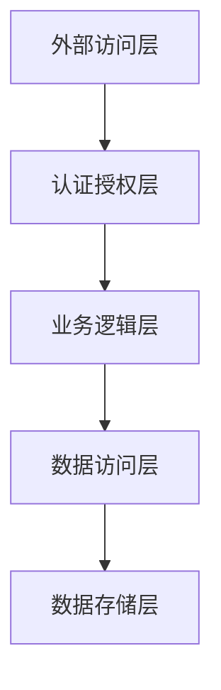

# 安全策略标准

**版本**: v1.0.0
**更新时间**: 2024-02-12
**相关文档**: 
- [核心服务标准](CoreService.md)
- [网络架构标准](NetworkArchitecture.md)
- [错误码标准](ErrorCodes.md)

## 1. 设计目标

- **安全性**：确保系统和数据的安全性
- **可靠性**：保证系统的可靠运行
- **合规性**：符合相关安全标准和法规
- **可维护性**：便于安全策略的维护和更新

## 2. 基本原则

### 2.1 安全架构



### 2.2 安全策略

1. 身份认证
   - 双因素认证
   - 密码复杂度要求
   - 会话管理
   - 令牌管理

2. 访问控制
   - 基于角色的访问控制(RBAC)
   - 最小权限原则
   - 资源隔离
   - 权限审计

## 3. 实现规范

### 3.1 认证实现

```python
class SecurityError(BaseError):
    """安全错误基类"""
    def __init__(self, code: int, message: str, details: Optional[Dict[str, Any]] = None):
        super().__init__(code, message, details)

class AuthenticationError(SecurityError):
    """认证错误"""
    def __init__(self, message: str, details: Optional[Dict[str, Any]] = None):
        super().__init__(40000, message, details)  # 使用标准错误码

class AuthorizationError(SecurityError):
    """授权错误"""
    def __init__(self, message: str, details: Optional[Dict[str, Any]] = None):
        super().__init__(40001, message, details)  # 使用标准错误码

class EncryptionError(SecurityError):
    """加密错误"""
    def __init__(self, message: str, details: Optional[Dict[str, Any]] = None):
        super().__init__(40003, message, details)  # 使用标准错误码
```

### 3.2 授权实现

```python
class AuthorizationService:
    """授权服务"""
    
    def __init__(self):
        self.role_manager = RoleManager()
        self.permission_checker = PermissionChecker()
        
    async def check_permission(
        self,
        user_id: str,
        resource: str,
        action: str
    ) -> bool:
        """检查权限"""
        # 获取用户角色
        roles = await self.role_manager.get_user_roles(user_id)
        
        # 检查权限
        return await self.permission_checker.check(roles, resource, action)
```

## 4. 安全协议

### 4.1 通信加密

1. TLS配置
```python
class TLSConfig:
    """TLS配置"""
    VERSION = "TLSv1.3"
    CIPHERS = "TLS_AES_256_GCM_SHA384"
    CERT_PATH = "/path/to/cert"
    KEY_PATH = "/path/to/key"
```

2. 数据加密
```python
class DataEncryption:
    """数据加密"""
    ALGORITHM = "AES-256-GCM"
    KEY_SIZE = 256
    IV_SIZE = 12
```

## 5. 错误处理

### 5.1 安全异常

```python
class SecurityError(Exception): pass
class AuthenticationError(SecurityError): pass
class AuthorizationError(SecurityError): pass
class EncryptionError(SecurityError): pass
```

### 5.2 错误恢复

1. 认证失败
```python
async def handle_auth_failure(self, user_id: str):
    """处理认证失败"""
    # 记录失败次数
    await self._increment_failure_count(user_id)
    
    # 检查是否需要锁定
    if await self._should_lockout(user_id):
        await self._lockout_user(user_id)
```

## 6. 监控规范

### 6.1 安全指标

1. 认证指标
- 认证成功率
- 失败尝试次数
- 锁定账户数
- 令牌使用情况

2. 授权指标
- 权限检查次数
- 访问拒绝率
- 角色变更频率
- 异常访问次数

### 6.2 安全日志

```python
{
    "timestamp": "ISO8601",
    "service": "security",
    "event": "auth|access|encrypt",
    "level": "INFO|WARNING|ERROR",
    "user_id": "xxx",
    "message": "详细信息",
    "data": {
        "ip": "xxx.xxx.xxx.xxx",
        "resource": "xxx",
        "action": "xxx",
        "result": "success|failure"
    }
}
```

## 7. 测试规范

### 7.1 安全测试

```python
class TestSecurity(unittest.TestCase):
    async def test_authentication(self):
        """测试认证"""
        auth = AuthenticationService()
        
        # 测试有效凭证
        credentials = {
            "username": "test",
            "password": "Test@123",
            "2fa_code": "123456"
        }
        self.assertTrue(await auth.authenticate(credentials))
        
        # 测试无效凭证
        credentials["password"] = "wrong"
        self.assertFalse(await auth.authenticate(credentials))
```

### 7.2 渗透测试

1. 测试项目
- SQL注入
- XSS攻击
- CSRF攻击
- 会话劫持

2. 测试工具
- OWASP ZAP
- Burp Suite
- Metasploit
- Nmap

## 8. 应急响应

### 8.1 响应流程

1. 发现和报告
2. 分类和评估
3. 遏制和消除
4. 恢复和加固
5. 总结和改进

### 8.2 应急预案

1. 账户泄露
```python
async def handle_account_breach(self, user_id: str):
    """处理账户泄露"""
    # 锁定账户
    await self._lock_account(user_id)
    
    # 撤销所有令牌
    await self._revoke_all_tokens(user_id)
    
    # 通知用户
    await self._notify_user(user_id)
    
    # 记录事件
    await self._log_security_event(user_id, "account_breach")
```

2. 数据泄露
```python
async def handle_data_breach(self, data_id: str):
    """处理数据泄露"""
    # 隔离数据
    await self._isolate_data(data_id)
    
    # 评估影响
    impact = await self._assess_impact(data_id)
    
    # 采取措施
    await self._take_actions(impact)
    
    # 通知相关方
    await self._notify_stakeholders(impact)
```

## 9. 版本历史

### v1.0.0 (2024-02-12)
- 初始版本
- 定义安全架构
- 实现认证授权
- 建立加密机制
- 引入错误码标准
- 完善错误处理机制

### v0.9.0 (2024-02-07)
- 预发布版本
- 完成安全设计
- 实现基础功能
- 添加审计机制

### v0.8.0 (2024-02-06)
- 草稿版本
- 开始安全标准化
- 定义基本接口
- 设计数据结构 