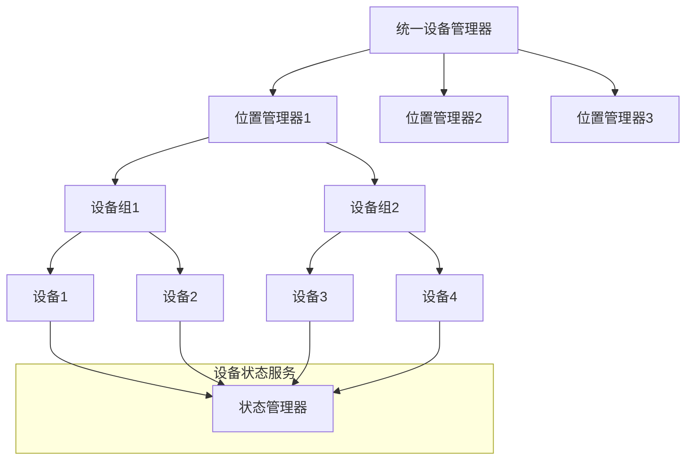

# 设备管理标准

**版本**: v1.0.0
**更新时间**: 2024-02-12
**相关文档**: 
- [网络架构标准](../core/NetworkArchitecture.md)
- [设备注册标准](DeviceRegistry.md)
- [状态同步标准](StateSync.md)
- [安全策略标准](../core/SecurityPolicy.md)

## 1. 设计目标

- **统一管理**: 提供统一的设备管理接口
- **层级控制**: 支持基于位置的分层管理
- **智能控制**: 支持场景联动和自动化
- **可靠运维**: 提供完整的设备运维能力

## 2. 管理架构

### 2.1 管理层级



### 2.2 管理模型

```python
@dataclass
class DeviceGroup:
    """设备组"""
    group_id: str         # 组ID
    name: str            # 组名称
    location_id: str     # 位置ID
    devices: List[str]   # 设备列表
    metadata: Dict[str, Any] = field(default_factory=dict)

@dataclass
class DeviceControl:
    """设备控制"""
    device_id: str       # 设备ID
    command: str        # 命令
    parameters: Dict[str, Any] # 参数
    timeout: float = 5.0 # 超时时间
```

## 3. 设备分组

### 3.1 组管理

```python
class GroupManager:
    """组管理器"""
    
    async def create_group(
        self,
        location_id: str,
        name: str,
        metadata: Optional[Dict[str, Any]] = None
    ) -> str:
        """创建设备组"""
        pass
        
    async def delete_group(self, group_id: str) -> bool:
        """删除设备组"""
        pass
        
    async def add_device_to_group(
        self,
        group_id: str,
        device_id: str
    ) -> bool:
        """添加设备到组"""
        pass
        
    async def remove_device_from_group(
        self,
        group_id: str,
        device_id: str
    ) -> bool:
        """从组中移除设备"""
        pass
```

### 3.2 组操作

```python
class GroupOperation:
    """组操作"""
    
    async def control_group(
        self,
        group_id: str,
        command: str,
        parameters: Dict[str, Any]
    ) -> Dict[str, Any]:
        """控制设备组
        
        1. 验证组权限
        2. 获取组设备列表
        3. 并行执行命令
        4. 聚合执行结果
        """
        pass
        
    async def get_group_state(
        self,
        group_id: str
    ) -> Dict[str, Any]:
        """获取组状态
        
        1. 获取组设备列表
        2. 并行获取状态
        3. 聚合状态信息
        """
        pass
```

## 4. 设备控制

### 4.1 控制接口

```python
class DeviceController:
    """设备控制器"""
    
    async def execute_command(
        self,
        control: DeviceControl
    ) -> Dict[str, Any]:
        """执行设备命令
        
        1. 验证设备状态
        2. 检查命令权限
        3. 执行具体命令
        4. 返回执行结果
        """
        pass
        
    async def batch_execute(
        self,
        controls: List[DeviceControl]
    ) -> Dict[str, Any]:
        """批量执行命令
        
        1. 验证所有命令
        2. 并行执行命令
        3. 聚合执行结果
        """
        pass
```

### 4.2 参数验证

```python
class ParameterValidator:
    """参数验证器"""
    
    def validate_parameters(
        self,
        device_type: str,
        command: str,
        parameters: Dict[str, Any]
    ) -> bool:
        """验证命令参数
        
        1. 检查参数完整性
        2. 验证参数类型
        3. 检查参数范围
        4. 验证参数组合
        """
        pass
```

## 5. 设备运维

### 5.1 健康检查

```python
class HealthCheck:
    """健康检查"""
    
    async def check_device_health(
        self,
        device_id: str
    ) -> Dict[str, Any]:
        """检查设备健康状态
        
        1. 检查连接状态
        2. 验证响应时间
        3. 检查资源使用
        4. 验证功能完整
        """
        pass
        
    async def diagnose_device(
        self,
        device_id: str,
        check_items: List[str]
    ) -> Dict[str, Any]:
        """诊断设备问题
        
        1. 执行指定检查
        2. 分析问题原因
        3. 生成诊断报告
        4. 提供修复建议
        """
        pass
```

### 5.2 固件管理

```python
class FirmwareManager:
    """固件管理器"""
    
    async def check_update(
        self,
        device_id: str
    ) -> Optional[Dict[str, Any]]:
        """检查更新
        
        1. 获取当前版本
        2. 检查可用更新
        3. 验证兼容性
        4. 返回更新信息
        """
        pass
        
    async def update_firmware(
        self,
        device_id: str,
        version: str
    ) -> bool:
        """更新固件
        
        1. 下载固件包
        2. 验证完整性
        3. 执行更新
        4. 验证结果
        """
        pass
```

## 6. 自动化管理

### 6.1 场景联动

```python
class SceneAutomation:
    """场景自动化"""
    
    async def create_scene(
        self,
        name: str,
        triggers: List[Dict[str, Any]],
        actions: List[Dict[str, Any]]
    ) -> str:
        """创建场景
        
        1. 验证触发条件
        2. 验证动作列表
        3. 保存场景配置
        4. 启动场景监听
        """
        pass
        
    async def execute_scene(
        self,
        scene_id: str
    ) -> bool:
        """执行场景
        
        1. 获取场景配置
        2. 检查执行条件
        3. 按序执行动作
        4. 记录执行结果
        """
        pass
```

### 6.2 定时任务

```python
class ScheduleManager:
    """定时管理器"""
    
    async def create_schedule(
        self,
        device_id: str,
        command: str,
        parameters: Dict[str, Any],
        schedule: str
    ) -> str:
        """创建定时任务
        
        1. 验证定时格式
        2. 检查命令有效
        3. 保存任务配置
        4. 启动定时器
        """
        pass
```

## 7. 监控规范

### 7.1 监控指标

1. 设备指标
- 在线率
- 响应时间
- 命令成功率
- 资源使用率

2. 管理指标
- 设备总数
- 分组数量
- 场景数量
- 任务数量

### 7.2 日志规范

```python
{
    "timestamp": "ISO8601",
    "service": "device_manager",
    "event": "control|group|scene|schedule",
    "level": "INFO|WARNING|ERROR",
    "target_id": "xxx",
    "message": "详细信息",
    "data": {
        "command": "xxx",
        "result": "success|failure",
        "duration_ms": 100,
        "error": "xxx"
    }
}
```

## 8. 安全规范

### 8.1 访问控制

1. 权限级别
- 系统级权限
- 位置级权限
- 分组级权限
- 设备级权限

2. 操作限制
- 命令白名单
- 参数范围限制
- 执行频率限制
- 批量操作限制

### 8.2 运行安全

1. 资源控制
- 内存限制
- CPU限制
- 并发限制
- 队列限制

2. 故障保护
- 超时保护
- 熔断机制
- 降级策略
- 恢复机制

