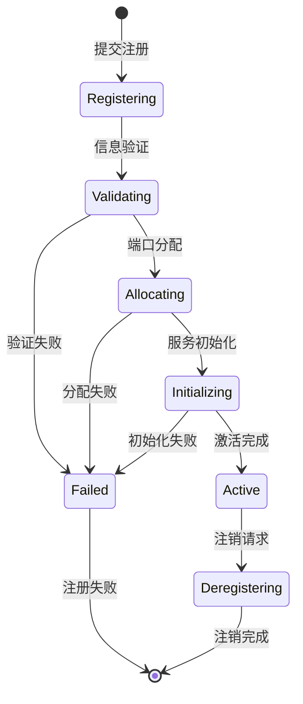

# 设备注册标准

**版本**: v1.0.0
**更新时间**: 2024-02-12
**相关文档**: 
- [网络架构标准](../core/NetworkArchitecture.md)
- [状态同步标准](StateSync.md)
- [设备管理标准](DeviceManagement.md)
- [安全策略标准](../core/SecurityPolicy.md)
- [错误码标准](../core/ErrorCodes.md)

## 1. 设计目标

- **统一管理**: 提供统一的设备注册和发现机制
- **层级管理**: 支持基于位置的设备分组管理
- **动态扩展**: 支持设备的动态注册和注销
- **状态追踪**: 维护设备的实时状态和健康状况

## 2. 注册流程

### 2.1 位置注册

```python
@dataclass
class LocationRegistration:
    """位置注册请求"""
    location_id: str        # 位置ID
    name: str              # 位置名称
    description: str       # 位置描述
    metadata: Dict[str, Any] = field(default_factory=dict)

async def register_location(request: LocationRegistration) -> LocationInfo:
    """注册位置
    
    1. 验证位置信息
    2. 分配服务端口
    3. 创建状态服务
    4. 返回位置信息
    """
    pass
```

### 2.2 设备注册

```python
@dataclass
class DeviceRegistration:
    """设备注册请求"""
    device_id: str         # 设备ID
    name: str             # 设备名称
    type: str             # 设备类型
    location_id: str      # 位置ID
    capabilities: List[str] # 设备能力
    metadata: Dict[str, Any] = field(default_factory=dict)

async def register_device(request: DeviceRegistration) -> DeviceInfo:
    """注册设备
    
    1. 验证设备信息
    2. 验证位置有效性
    3. 分配设备端口
    4. 注册到位置管理器
    5. 返回设备信息
    """
    pass
```

## 3. 注册验证

### 3.1 位置验证规则

1. 位置ID规范
```python
LOCATION_ID_PATTERN = r'^[a-z0-9][a-z0-9_-]{2,31}$'
LOCATION_NAME_MAX_LENGTH = 64
```

2. 必需字段验证
```python
def validate_location(registration: LocationRegistration) -> bool:
    """验证位置注册信息
    
    - ID格式验证
    - 名称长度验证
    - 描述完整性验证
    - 元数据格式验证
    """
    pass
```

### 3.2 设备验证规则

1. 设备ID规范
```python
DEVICE_ID_PATTERN = r'^[a-z0-9][a-z0-9_-]{2,31}$'
DEVICE_NAME_MAX_LENGTH = 64
```

2. 必需字段验证
```python
def validate_device(registration: DeviceRegistration) -> bool:
    """验证设备注册信息
    
    - ID格式验证
    - 名称长度验证
    - 类型有效性验证
    - 位置存在性验证
    - 能力列表验证
    - 元数据格式验证
    """
    pass
```

## 4. 状态管理

### 4.1 位置状态

```python
@dataclass
class LocationState:
    """位置状态"""
    location_id: str       # 位置ID
    status: str           # 状态(active/inactive/error)
    device_count: int     # 设备数量
    last_heartbeat: datetime # 最后心跳时间
    error_message: Optional[str] = None # 错误信息
```

### 4.2 设备状态

```python
@dataclass
class DeviceState:
    """设备状态"""
    device_id: str        # 设备ID
    status: str          # 状态(online/offline/error)
    location_id: str     # 位置ID
    last_heartbeat: datetime # 最后心跳时间
    metrics: Dict[str, Any] # 设备指标
    error_message: Optional[str] = None # 错误信息
```

## 5. 生命周期管理

### 5.1 注册生命周期



### 5.2 状态转换

```python
class DeviceStatus(str, Enum):
    """设备状态枚举"""
    REGISTERING = "registering"  # 注册中
    ACTIVE = "active"           # 活跃
    INACTIVE = "inactive"       # 不活跃
    ERROR = "error"            # 错误
    DEREGISTERING = "deregistering" # 注销中
```

## 6. 错误处理

### 6.1 错误类型

```python
class RegistryError(BaseError):
    """注册错误基类"""
    def __init__(self, code: int, message: str, details: Optional[Dict[str, Any]] = None):
        super().__init__(code, message, details)

class ValidationError(RegistryError):
    """验证错误"""
    def __init__(self, message: str, details: Optional[Dict[str, Any]] = None):
        super().__init__(20104, message, details)  # 使用标准错误码

class LocationError(RegistryError):
    """位置错误"""
    def __init__(self, message: str, details: Optional[Dict[str, Any]] = None):
        super().__init__(20100, message, details)  # 使用标准错误码

class DeviceError(RegistryError):
    """设备错误"""
    def __init__(self, message: str, details: Optional[Dict[str, Any]] = None):
        super().__init__(20101, message, details)  # 使用标准错误码

class StateError(RegistryError):
    """状态错误"""
    def __init__(self, message: str, details: Optional[Dict[str, Any]] = None):
        super().__init__(50001, message, details)  # 使用标准错误码
```

### 6.2 错误恢复

1. 注册失败恢复
```python
async def handle_registration_failure(
    registration_id: str,
    error: RegistryError
) -> None:
    """处理注册失败
    
    1. 清理临时资源
    2. 回滚状态变更
    3. 通知相关服务
    4. 记录错误日志
    """
    pass
```

2. 状态恢复
```python
async def recover_device_state(device_id: str) -> bool:
    """恢复设备状态
    
    1. 获取最后已知状态
    2. 验证当前状态
    3. 执行状态恢复
    4. 更新状态记录
    """
    pass
```

## 7. 监控规范

### 7.1 注册指标

1. 基础指标
- 注册成功率
- 注册延迟
- 验证失败率
- 端口分配失败率

2. 状态指标
- 活跃设备数
- 位置健康度
- 心跳成功率
- 错误发生率

### 7.2 日志规范

```python
{
    "timestamp": "ISO8601",
    "service": "device_registry",
    "event": "register|deregister|status_change",
    "level": "INFO|WARNING|ERROR",
    "target_id": "xxx",
    "target_type": "location|device",
    "message": "详细信息",
    "data": {
        "status": "xxx",
        "port": 9000,
        "location": "xxx",
        "error": "xxx"
    }
}
```

## 8. 安全规范

### 8.1 访问控制

1. 认证要求
- 位置级别认证
- 设备级别认证
- 令牌有效期管理
- 权限级别控制

2. 操作审计
- 注册操作记录
- 状态变更记录
- 错误事件记录
- 安全事件记录

### 8.2 数据安全

1. 传输安全
- TLS加密通信
- 证书验证
- 安全握手
- 会话管理

2. 存储安全
- 数据加密存储
- 访问权限控制
- 备份策略
- 数据清理 

## 9. 版本历史

### v1.0.0 (2024-02-12)
- 初始版本
- 定义设备注册流程
- 实现位置和设备注册
- 建立状态管理机制
- 引入错误码标准
- 完善错误处理机制

### v0.9.0 (2024-02-07)
- 预发布版本
- 完成注册流程设计
- 实现基础验证
- 添加状态追踪

### v0.8.0 (2024-02-06)
- 草稿版本
- 开始注册标准化
- 定义基本接口
- 设计数据结构 