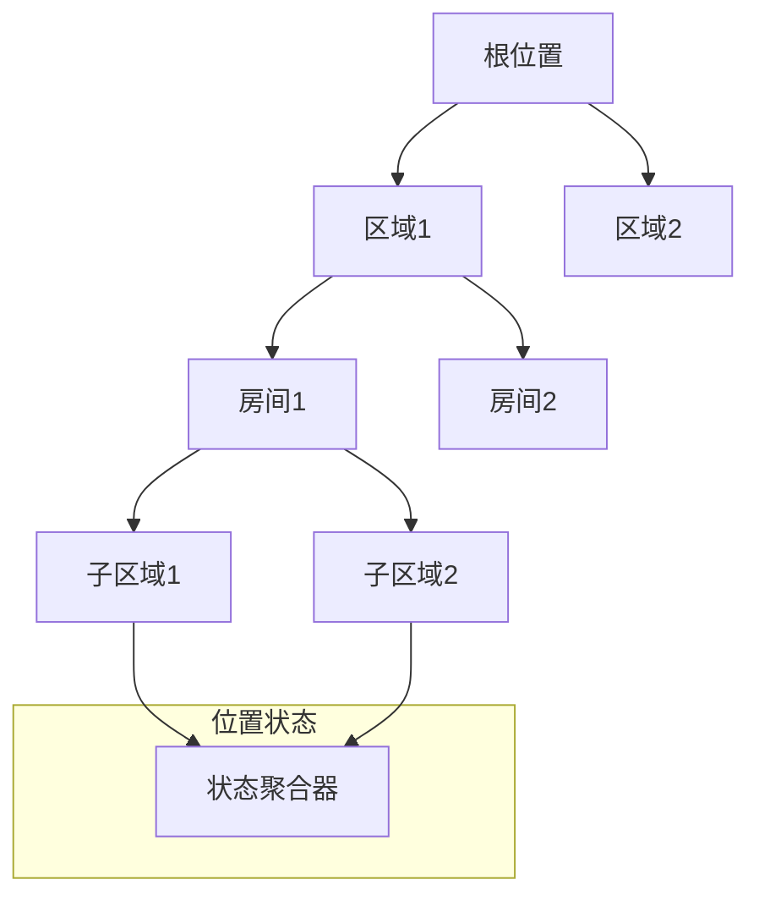

# 位置管理标准

**版本**: v1.0.0
**更新时间**: 2024-02-12
**相关文档**: 
- [网络架构标准](../core/NetworkArchitecture.md)
- [设备注册标准](DeviceRegistry.md)
- [设备管理标准](DeviceManagement.md)
- [状态同步标准](StateSync.md)

## 1. 设计目标

- **位置隔离**: 确保不同位置的设备和状态相互隔离
- **状态聚合**: 提供位置级别的状态聚合和管理
- **场景管理**: 支持位置级别的场景定义和执行
- **资源优化**: 优化位置内的资源分配和使用

## 2. 位置模型

### 2.1 位置定义

```python
@dataclass
class Location:
    """位置定义"""
    location_id: str      # 位置ID
    name: str            # 位置名称
    description: str     # 位置描述
    parent_id: Optional[str] = None  # 父位置ID
    metadata: Dict[str, Any] = field(default_factory=dict)

@dataclass
class LocationState:
    """位置状态"""
    location_id: str      # 位置ID
    device_count: int    # 设备数量
    online_count: int    # 在线设备数
    scene_count: int     # 场景数量
    last_update: datetime # 最后更新时间
    metrics: Dict[str, Any] = field(default_factory=dict)
```

### 2.2 位置层级



## 3. 位置管理

### 3.1 位置操作

```python
class LocationManager:
    """位置管理器"""
    
    async def create_location(
        self,
        name: str,
        description: str,
        parent_id: Optional[str] = None,
        metadata: Optional[Dict[str, Any]] = None
    ) -> str:
        """创建位置
        
        1. 验证位置信息
        2. 检查父位置
        3. 分配位置ID
        4. 初始化服务
        """
        pass
        
    async def delete_location(
        self,
        location_id: str,
        recursive: bool = False
    ) -> bool:
        """删除位置
        
        1. 验证位置存在
        2. 检查子位置
        3. 迁移或删除设备
        4. 清理资源
        """
        pass
        
    async def update_location(
        self,
        location_id: str,
        updates: Dict[str, Any]
    ) -> bool:
        """更新位置信息
        
        1. 验证更新内容
        2. 应用更新
        3. 触发事件
        """
        pass
```

### 3.2 位置查询

```python
class LocationQuery:
    """位置查询"""
    
    async def get_location(
        self,
        location_id: str
    ) -> Optional[Location]:
        """获取位置信息"""
        pass
        
    async def get_children(
        self,
        location_id: str
    ) -> List[Location]:
        """获取子位置列表"""
        pass
        
    async def get_devices(
        self,
        location_id: str,
        recursive: bool = False
    ) -> List[str]:
        """获取位置下的设备列表"""
        pass
        
    async def search_locations(
        self,
        query: Dict[str, Any]
    ) -> List[Location]:
        """搜索位置"""
        pass
```

## 4. 状态管理

### 4.1 状态聚合

```python
class StateAggregator:
    """状态聚合器"""
    
    async def aggregate_device_states(
        self,
        location_id: str
    ) -> Dict[str, Any]:
        """聚合设备状态
        
        1. 获取所有设备
        2. 并行获取状态
        3. 聚合处理
        4. 缓存结果
        """
        pass
        
    async def aggregate_metrics(
        self,
        location_id: str
    ) -> Dict[str, Any]:
        """聚合位置指标
        
        1. 收集设备指标
        2. 收集服务指标
        3. 计算统计值
        4. 更新存储
        """
        pass
```

### 4.2 状态订阅

```python
class StateSubscription:
    """状态订阅"""
    
    async def subscribe_location_state(
        self,
        location_id: str,
        callback: Callable[[Dict[str, Any]], Awaitable[None]]
    ) -> str:
        """订阅位置状态"""
        pass
        
    async def subscribe_device_states(
        self,
        location_id: str,
        device_types: Optional[List[str]] = None,
        callback: Callable[[str, Dict[str, Any]], Awaitable[None]]
    ) -> str:
        """订阅设备状态"""
        pass
```

## 5. 场景管理

### 5.1 场景定义

```python
@dataclass
class LocationScene:
    """位置场景"""
    scene_id: str        # 场景ID
    location_id: str     # 位置ID
    name: str           # 场景名称
    description: str    # 场景描述
    triggers: List[Dict[str, Any]]  # 触发条件
    actions: List[Dict[str, Any]]   # 执行动作
    enabled: bool = True
```

### 5.2 场景控制

```python
class SceneController:
    """场景控制器"""
    
    async def create_scene(
        self,
        location_id: str,
        scene_def: Dict[str, Any]
    ) -> str:
        """创建场景"""
        pass
        
    async def execute_scene(
        self,
        scene_id: str,
        parameters: Optional[Dict[str, Any]] = None
    ) -> bool:
        """执行场景"""
        pass
```

## 6. 资源管理

### 6.1 资源分配

```python
class ResourceManager:
    """资源管理器"""
    
    async def allocate_resources(
        self,
        location_id: str,
        requirements: Dict[str, Any]
    ) -> Dict[str, Any]:
        """分配资源
        
        1. 检查资源可用性
        2. 计算分配方案
        3. 执行资源分配
        4. 更新使用记录
        """
        pass
        
    async def release_resources(
        self,
        location_id: str,
        resource_ids: List[str]
    ) -> bool:
        """释放资源"""
        pass
```

### 6.2 资源监控

```python
class ResourceMonitor:
    """资源监控器"""
    
    async def get_resource_usage(
        self,
        location_id: str
    ) -> Dict[str, Any]:
        """获取资源使用情况"""
        pass
        
    async def check_resource_health(
        self,
        location_id: str
    ) -> Dict[str, Any]:
        """检查资源健康状态"""
        pass
```

## 7. 监控规范

### 7.1 监控指标

1. 位置指标
- 设备总数
- 在线率
- 场景数量
- 资源使用率

2. 性能指标
- 状态同步延迟
- 命令响应时间
- 场景执行时间
- 资源分配延迟

### 7.2 日志规范

```python
{
    "timestamp": "ISO8601",
    "service": "location_manager",
    "event": "create|delete|update|execute",
    "level": "INFO|WARNING|ERROR",
    "location_id": "xxx",
    "message": "详细信息",
    "data": {
        "operation": "xxx",
        "result": "success|failure",
        "duration_ms": 100,
        "error": "xxx"
    }
}
```

## 8. 安全规范

### 8.1 访问控制

1. 权限管理
- 位置创建权限
- 设备管理权限
- 场景管理权限
- 资源管理权限

2. 数据隔离
- 位置数据隔离
- 设备状态隔离
- 场景配置隔离
- 资源使用隔离

### 8.2 安全审计

1. 操作审计
- 位置操作记录
- 设备操作记录
- 场景操作记录
- 资源操作记录

2. 异常监控
- 权限违规监控
- 资源滥用监控
- 操作异常监控
- 数据异常监控 