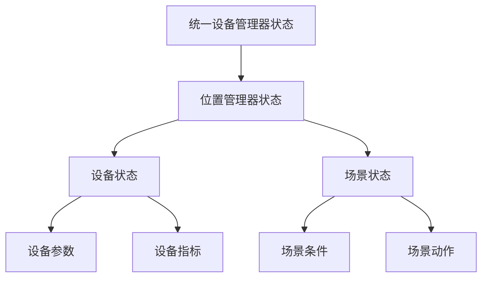

# 状态同步标准

**版本**: v1.0.0
**更新时间**: 2024-02-12
**相关文档**: 
- [网络架构标准](../core/NetworkArchitecture.md)
- [设备注册标准](DeviceRegistry.md)
- [设备管理标准](DeviceManagement.md)
- [安全策略标准](../core/SecurityPolicy.md)
- [错误码标准](../core/ErrorCodes.md)

## 1. 设计目标

- **实时性**: 确保状态变更的实时同步
- **一致性**: 保证各层级状态的一致性
- **可靠性**: 提供可靠的状态存储和恢复机制
- **扩展性**: 支持多种状态类型和同步策略

## 2. 状态定义

### 2.1 状态层级



### 2.2 状态模型

```python
@dataclass
class StateDefinition:
    """状态定义"""
    state_id: str         # 状态ID
    owner_id: str         # 所有者ID
    state_type: str       # 状态类型
    value: Any            # 状态值
    timestamp: datetime   # 时间戳
    version: int          # 版本号
    parent_id: Optional[str] = None  # 父状态ID
    
@dataclass
class StateChange:
    """状态变更"""
    state_id: str         # 状态ID
    old_value: Any        # 旧值
    new_value: Any        # 新值
    change_type: str      # 变更类型
    timestamp: datetime   # 时间戳
    source: str          # 变更来源
```

## 3. 同步机制

### 3.1 状态传播

```python
class StatePropagation:
    """状态传播"""
    
    async def propagate_up(self, state_change: StateChange) -> None:
        """向上传播状态变更
        
        1. 更新父状态
        2. 触发父状态回调
        3. 继续向上传播
        """
        pass
        
    async def propagate_down(self, state_change: StateChange) -> None:
        """向下传播状态变更
        
        1. 更新子状态
        2. 触发子状态回调
        3. 继续向下传播
        """
        pass
```

### 3.2 冲突解决

```python
class ConflictResolver:
    """冲突解决器"""
    
    def resolve_conflict(
        self,
        local_state: StateDefinition,
        remote_state: StateDefinition
    ) -> StateDefinition:
        """解决状态冲突
        
        1. 比较版本号
        2. 检查时间戳
        3. 应用解决策略
        4. 返回最终状态
        """
        pass
```

## 4. 存储机制

### 4.1 状态存储

```python
class StateStorage:
    """状态存储"""
    
    async def save_state(self, state: StateDefinition) -> bool:
        """保存状态"""
        pass
        
    async def load_state(self, state_id: str) -> Optional[StateDefinition]:
        """加载状态"""
        pass
        
    async def delete_state(self, state_id: str) -> bool:
        """删除状态"""
        pass
```

### 4.2 变更历史

```python
class ChangeHistory:
    """变更历史"""
    
    async def record_change(self, change: StateChange) -> None:
        """记录变更"""
        pass
        
    async def get_changes(
        self,
        state_id: str,
        start_time: datetime,
        end_time: datetime
    ) -> List[StateChange]:
        """获取变更历史"""
        pass
```

## 5. 订阅机制

### 5.1 状态订阅

```python
class StateSubscription:
    """状态订阅"""
    
    async def subscribe(
        self,
        state_pattern: str,
        callback: Callable[[StateChange], Awaitable[None]]
    ) -> str:
        """订阅状态变更
        
        Args:
            state_pattern: 状态匹配模式
            callback: 回调函数
            
        Returns:
            str: 订阅ID
        """
        pass
        
    async def unsubscribe(self, subscription_id: str) -> None:
        """取消订阅"""
        pass
```

### 5.2 通知分发

```python
class NotificationDispatcher:
    """通知分发器"""
    
    async def dispatch(self, change: StateChange) -> None:
        """分发状态变更通知
        
        1. 查找匹配的订阅
        2. 异步调用回调
        3. 处理错误情况
        """
        pass
```

## 6. 错误处理

### 6.1 错误类型

```python
class StateSyncError(BaseError):
    """状态同步错误基类"""
    def __init__(self, code: int, message: str, details: Optional[Dict[str, Any]] = None):
        super().__init__(code, message, details)

class StateNotFoundError(StateSyncError):
    """状态不存在错误"""
    def __init__(self, message: str, details: Optional[Dict[str, Any]] = None):
        super().__init__(50000, message, details)  # 使用标准错误码

class StateConflictError(StateSyncError):
    """状态冲突错误"""
    def __init__(self, message: str, details: Optional[Dict[str, Any]] = None):
        super().__init__(50002, message, details)  # 使用标准错误码

class StorageError(StateSyncError):
    """存储错误"""
    def __init__(self, message: str, details: Optional[Dict[str, Any]] = None):
        super().__init__(50001, message, details)  # 使用标准错误码

class PropagationError(StateSyncError):
    """传播错误"""
    def __init__(self, message: str, details: Optional[Dict[str, Any]] = None):
        super().__init__(30000, message, details)  # 使用标准错误码
```

### 6.2 恢复机制

```python
class StateRecovery:
    """状态恢复"""
    
    async def recover_state(self, state_id: str) -> bool:
        """恢复状态
        
        1. 加载最近的快照
        2. 应用后续变更
        3. 验证状态有效性
        4. 更新当前状态
        """
        pass
```

## 7. 监控规范

### 7.1 性能指标

1. 同步指标
- 同步延迟
- 冲突率
- 重试次数
- 成功率

2. 存储指标
- 读写延迟
- 存储容量
- 压缩比率
- 恢复时间

### 7.2 日志规范

```python
{
    "timestamp": "ISO8601",
    "service": "state_sync",
    "event": "sync|conflict|recover",
    "level": "INFO|WARNING|ERROR",
    "state_id": "xxx",
    "message": "详细信息",
    "data": {
        "old_value": "xxx",
        "new_value": "xxx",
        "version": 1,
        "latency_ms": 100
    }
}
```

## 8. 安全规范

### 8.1 访问控制

1. 权限控制
- 读取权限
- 写入权限
- 订阅权限
- 管理权限

2. 操作审计
- 状态变更审计
- 访问记录审计
- 订阅管理审计
- 恢复操作审计

### 8.2 数据安全

1. 传输安全
- 加密传输
- 完整性校验
- 身份验证
- 会话管理

2. 存储安全
- 加密存储
- 备份策略
- 数据隔离
- 清理策略 

## 9. 版本历史

### v1.0.0 (2024-02-12)
- 初始版本
- 定义状态同步机制
- 实现状态传播
- 建立冲突解决
- 引入错误码标准
- 完善错误处理机制

### v0.9.0 (2024-02-07)
- 预发布版本
- 完成同步机制设计
- 实现基础存储
- 添加订阅功能

### v0.8.0 (2024-02-06)
- 草稿版本
- 开始同步标准化
- 定义基本接口
- 设计数据结构 