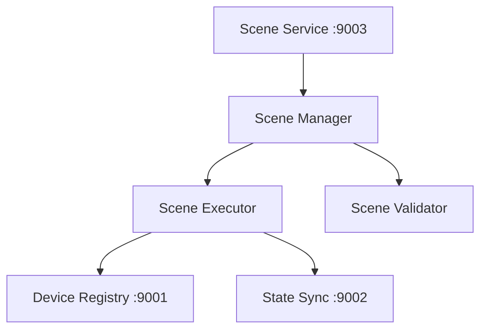

# 场景服务标准

**版本**: v1.0.0
**更新时间**: 2024-02-12
**相关文档**: 
- [核心服务标准](../core/CoreService.md)
- [设备管理标准](../devices/DeviceManagement.md)
- [状态同步标准](../devices/StateSync.md)
- [安全策略标准](../core/SecurityPolicy.md)

## 1. 场景管理架构

### 1.1 组件架构



### 1.2 服务端口

```python
# 场景服务端口
SCENE_SERVICE_PORT = 9003    # 场景服务
```

## 2. 场景定义协议

### 2.1 场景创建请求

```json
{
    "type": "create_scene",
    "scene": {
        "id": "scene_id",
        "name": "场景名称",
        "description": "场景描述",
        "triggers": [
            {
                "type": "time|device|manual",
                "condition": {
                    "type": "cron|state|event",
                    "value": "* * * * *"
                }
            }
        ],
        "actions": [
            {
                "device_id": "device_id",
                "action": "set_power",
                "parameters": {
                    "power": true
                },
                "delay": 0
            }
        ],
        "enabled": true
    }
}
```

### 2.2 场景执行请求

```json
{
    "type": "execute_scene",
    "scene_id": "scene_id",
    "trigger_info": {
        "type": "manual|auto",
        "source": "user_id|system",
        "timestamp": "ISO8601"
    }
}
```

## 3. 场景实现规范

### 3.1 场景管理器

```python
class SceneManager:
    """场景管理器"""
    
    def __init__(self, port: int):
        self.port = port
        self.server = None
        self._scenes = {}
        self._executor = SceneExecutor()
        self._validator = SceneValidator()
        
    async def start(self):
        """启动服务"""
        self.server = await asyncio.start_server(
            self.handle_request,
            'localhost',
            self.port
        )
        
    async def register_scene(self, scene: Scene) -> bool:
        """注册场景"""
        # 验证场景
        if not self._validator.validate(scene):
            return False
            
        # 注册场景
        self._scenes[scene.id] = scene
        return True
        
    async def execute_scene(self, scene_id: str) -> bool:
        """执行场景"""
        scene = self._scenes.get(scene_id)
        if not scene:
            return False
            
        return await self._executor.execute(scene)
```

### 3.2 场景执行器

```python
class SceneExecutor:
    """场景执行器"""
    
    def __init__(self):
        self.registry_client = None
        self.state_sync_client = None
        
    async def connect_services(self):
        """连接依赖服务"""
        # 连接设备注册服务
        self.registry_client = await asyncio.open_connection(
            'localhost', DEVICE_REGISTRY_PORT)
            
        # 连接状态同步服务
        self.state_sync_client = await asyncio.open_connection(
            'localhost', STATE_SYNC_PORT)
            
    async def execute(self, scene: Scene) -> bool:
        """执行场景"""
        try:
            # 检查条件
            if not await self._check_conditions(scene.conditions):
                return False
                
            # 执行动作
            for action in scene.actions:
                success = await self._execute_action(action)
                if not success:
                    return False
                    
            return True
            
        except Exception as e:
            logger.error(f"执行场景失败: {str(e)}")
            return False
```

## 4. 错误处理

### 4.1 错误类型

```python
class SceneError(Exception): pass
class ValidationError(SceneError): pass
class ExecutionError(SceneError): pass
class CommunicationError(SceneError): pass
```

### 4.2 错误恢复

1. 执行失败
```python
async def execute_with_retry(self, scene: Scene, max_retries: int = 3):
    """重试执行"""
    for i in range(max_retries):
        try:
            return await self.execute(scene)
        except ExecutionError:
            await asyncio.sleep(1 * (i + 1))
    return False
```

2. 连接断开
```python
async def handle_connection_lost(self):
    """处理连接断开"""
    while True:
        try:
            await self.connect_services()
            break
        except CommunicationError:
            await asyncio.sleep(5)
```

## 5. 监控规范

### 5.1 场景指标

1. 基础指标
- 场景数量
- 执行次数
- 成功率
- 平均执行时间

2. 业务指标
- 触发类型分布
- 动作执行分布
- 失败原因分析
- 设备参与度

### 5.2 日志规范

```python
{
    "timestamp": "ISO8601",
    "scene_id": "xxx",
    "event": "create|execute|error",
    "level": "INFO|WARNING|ERROR",
    "message": "详细信息",
    "data": {
        "trigger": "xxx",
        "actions": [],
        "duration_ms": 100
    }
}
```

## 6. 测试规范

### 6.1 单元测试

```python
class TestSceneManager(unittest.TestCase):
    async def test_scene_registration(self):
        """测试场景注册"""
        manager = SceneManager(SCENE_SERVICE_PORT)
        scene = Scene(
            id="test001",
            name="测试场景",
            triggers=[
                {
                    "type": "time",
                    "condition": {"type": "cron", "value": "0 8 * * *"}
                }
            ],
            actions=[
                {
                    "device_id": "light001",
                    "action": "set_power",
                    "parameters": {"power": True}
                }
            ]
        )
        success = await manager.register_scene(scene)
        self.assertTrue(success)
```

### 6.2 集成测试

```python
class TestSceneIntegration(unittest.TestCase):
    async def test_scene_execution(self):
        """测试场景执行"""
        # 创建场景
        scene = Scene(
            id="test001",
            name="测试场景",
            actions=[
                {
                    "device_id": "ac001",
                    "action": "set_temperature",
                    "parameters": {"temperature": 26}
                },
                {
                    "device_id": "light001",
                    "action": "set_power",
                    "parameters": {"power": True}
                }
            ]
        )
        
        # 注册场景
        manager = SceneManager(SCENE_SERVICE_PORT)
        await manager.register_scene(scene)
        
        # 执行场景
        success = await manager.execute_scene(scene.id)
        self.assertTrue(success)
        
        # 验证结果
        ac_state = await device_manager.get_device_state("ac001")
        self.assertEqual(ac_state["temperature"], 26)
        
        light_state = await device_manager.get_device_state("light001")
        self.assertTrue(light_state["power"])
```

## 7. 安全规范

### 7.1 访问控制

1. 场景权限
```python
class ScenePermission:
    """场景权限"""
    def __init__(self):
        self.owner: str       # 场景所有者
        self.shared: List[str] # 共享用户列表
        self.public: bool     # 是否公开
```

2. 操作权限
```python
class OperationPermission:
    """操作权限"""
    VIEW = 1   # 查看
    EDIT = 2   # 编辑
    EXECUTE = 4 # 执行
    DELETE = 8  # 删除
```

### 7.2 数据安全

1. 场景加密
```python
class SceneEncryption:
    """场景加密"""
    
    def encrypt_scene(self, scene: Scene) -> bytes:
        """加密场景数据"""
        pass
        
    def decrypt_scene(self, data: bytes) -> Scene:
        """解密场景数据"""
        pass
```

2. 安全配置
```python
class SecurityConfig:
    """安全配置"""
    ENCRYPTION_ALGORITHM = "AES-256-GCM"
    KEY_ROTATION_INTERVAL = 24 * 60 * 60  # 24小时
    MAX_TOKEN_AGE = 30 * 24 * 60 * 60    # 30天
    MIN_TLS_VERSION = "TLSv1.3"
``` 