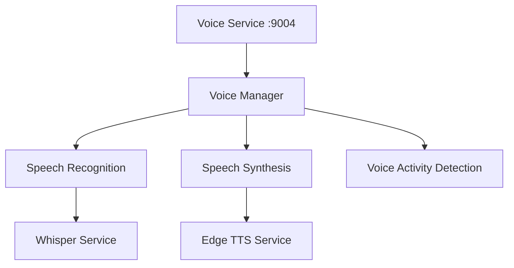

# 语音服务标准

**版本**: v1.0.0
**更新时间**: 2024-02-12
**相关文档**: 
- [核心服务标准](../core/CoreService.md)
- [代理模块标准](../agents/AgentModule.md)
- [LLM服务标准](LLMService.md)
- [安全策略标准](../core/SecurityPolicy.md)
- [错误码标准](../core/ErrorCodes.md)

## 1. 语音服务架构

### 1.1 组件架构



### 1.2 服务端口

```python
# 语音服务端口
VOICE_SERVICE_PORT = 9004     # 语音服务
WHISPER_SERVICE_PORT = 9005   # 语音识别服务
TTS_SERVICE_PORT = 9006      # 语音合成服务
```

## 2. 语音服务协议

### 2.1 语音识别请求

```json
{
    "type": "recognize",
    "audio": {
        "format": "wav",
        "channels": 1,
        "sample_rate": 16000,
        "data": "base64_encoded_audio_data"
    },
    "config": {
        "language": "zh",
        "model": "base",
        "task": "transcribe"
    }
}
```

### 2.2 语音合成请求

```json
{
    "type": "synthesize",
    "text": "要合成的文本",
    "config": {
        "voice": "zh-CN-XiaoxiaoNeural",
        "rate": 0,
        "volume": 100
    }
}
```

## 3. 服务实现规范

### 3.1 语音管理器

```python
class VoiceManager:
    """语音管理器"""
    
    def __init__(self, port: int):
        self.port = port
        self.server = None
        self._whisper = None
        self._tts = None
        self._vad = None
        
    async def start(self):
        """启动服务"""
        # 初始化语音识别
        self._whisper = whisper.load_model("base")
        
        # 初始化语音合成
        self._tts = edge_tts.Communicate()
        
        # 初始化VAD
        self._vad = webrtcvad.Vad(3)
        
        # 启动服务器
        self.server = await asyncio.start_server(
            self.handle_request,
            'localhost',
            self.port
        )
        
    async def recognize(self, audio_data: bytes) -> str:
        """语音识别"""
        # 保存临时文件
        with tempfile.NamedTemporaryFile(suffix='.wav') as f:
            f.write(audio_data)
            f.flush()
            
            # 识别音频
            result = self._whisper.transcribe(f.name)
            return result["text"].strip()
            
    async def synthesize(self, text: str) -> bytes:
        """语音合成"""
        return await self._tts.synthesize(text)
```

### 3.2 语音活动检测

```python
class VADProcessor:
    """语音活动检测处理器"""
    
    def __init__(self, sample_rate: int = 16000):
        self.sample_rate = sample_rate
        self.frame_duration = 30  # ms
        self.vad = webrtcvad.Vad(3)
        
    def process_frame(self, frame: bytes) -> bool:
        """处理音频帧"""
        return self.vad.is_speech(frame, self.sample_rate)
        
    def get_frame_size(self) -> int:
        """获取帧大小"""
        return int(self.sample_rate * self.frame_duration / 1000)
```

## 4. 错误处理

### 4.1 错误类型

```python
class VoiceError(BaseError):
    """语音服务错误基类"""
    def __init__(self, code: int, message: str, details: Optional[Dict[str, Any]] = None):
        super().__init__(code, message, details)

class RecognitionError(VoiceError):
    """识别错误"""
    def __init__(self, message: str, details: Optional[Dict[str, Any]] = None):
        super().__init__(70001, message, details)  # 使用标准错误码

class SynthesisError(VoiceError):
    """合成错误"""
    def __init__(self, message: str, details: Optional[Dict[str, Any]] = None):
        super().__init__(70002, message, details)  # 使用标准错误码

class AudioError(VoiceError):
    """音频错误"""
    def __init__(self, message: str, details: Optional[Dict[str, Any]] = None):
        super().__init__(70003, message, details)  # 使用标准错误码
```

### 4.2 错误恢复

1. 识别失败
```python
async def recognize_with_retry(self, audio_data: bytes, max_retries: int = 3):
    """重试识别"""
    for i in range(max_retries):
        try:
            return await self.recognize(audio_data)
        except RecognitionError:
            await asyncio.sleep(1 * (i + 1))
    return None
```

2. 合成失败
```python
async def synthesize_with_fallback(self, text: str):
    """合成失败后的降级处理"""
    try:
        return await self.synthesize(text)
    except SynthesisError:
        return await self._synthesize_fallback(text)
```

## 5. 监控规范

### 5.1 服务指标

1. 基础指标
- 请求处理时间
- 识别准确率
- 合成质量
- 错误率

2. 业务指标
- 语音时长分布
- 文本长度分布
- 语言类型分布
- 模型使用率

### 5.2 日志规范

```python
{
    "timestamp": "ISO8601",
    "service": "voice",
    "event": "recognize|synthesize|error",
    "level": "INFO|WARNING|ERROR",
    "message": "详细信息",
    "data": {
        "duration_ms": 100,
        "audio_format": "wav",
        "text_length": 50
    }
}
```

## 6. 测试规范

### 6.1 单元测试

```python
class TestVoiceService(unittest.TestCase):
    async def test_recognition(self):
        """测试语音识别"""
        service = VoiceManager(VOICE_SERVICE_PORT)
        
        # 加载测试音频
        with open("test.wav", "rb") as f:
            audio_data = f.read()
            
        # 识别音频
        text = await service.recognize(audio_data)
        self.assertIsNotNone(text)
        self.assertTrue(len(text) > 0)
        
    async def test_synthesis(self):
        """测试语音合成"""
        service = VoiceManager(VOICE_SERVICE_PORT)
        
        # 合成文本
        audio_data = await service.synthesize("测试文本")
        self.assertIsNotNone(audio_data)
        self.assertTrue(len(audio_data) > 0)
```

### 6.2 集成测试

```python
class TestVoiceIntegration(unittest.TestCase):
    async def test_voice_interaction(self):
        """测试语音交互"""
        service = VoiceManager(VOICE_SERVICE_PORT)
        
        # 识别音频
        with open("test.wav", "rb") as f:
            audio_data = f.read()
        text = await service.recognize(audio_data)
        
        # 处理命令
        intent = await decoder_agent.decode_intent(text)
        success = await expert_agent.execute_intent(intent)
        self.assertTrue(success)
        
        # 合成反馈
        response = "命令已执行"
        audio_data = await service.synthesize(response)
        self.assertIsNotNone(audio_data)
```

## 7. 安全规范

### 7.1 音频安全

1. 音频加密
```python
class AudioEncryption:
    """音频加密"""
    
    def encrypt_audio(self, audio_data: bytes) -> bytes:
        """加密音频数据"""
        pass
        
    def decrypt_audio(self, encrypted_data: bytes) -> bytes:
        """解密音频数据"""
        pass
```

2. 隐私保护
```python
class PrivacyProtection:
    """隐私保护"""
    
    def mask_sensitive_info(self, text: str) -> str:
        """敏感信息脱敏"""
        pass
        
    def clean_audio_metadata(self, audio_data: bytes) -> bytes:
        """清理音频元数据"""
        pass
```

### 7.2 访问控制

1. 服务认证
```python
class ServiceAuth:
    """服务认证"""
    
    async def authenticate(self, token: str) -> bool:
        """验证访问令牌"""
        pass
        
    async def authorize(self, service_id: str, action: str) -> bool:
        """检查服务权限"""
        pass
```

2. 安全配置
```python
class SecurityConfig:
    """安全配置"""
    ENCRYPTION_ALGORITHM = "AES-256-GCM"
    KEY_ROTATION_INTERVAL = 24 * 60 * 60  # 24小时
    MAX_TOKEN_AGE = 30 * 24 * 60 * 60    # 30天
    MIN_TLS_VERSION = "TLSv1.3"
    MAX_AUDIO_SIZE = 10 * 1024 * 1024    # 10MB
    ALLOWED_AUDIO_FORMATS = ["wav", "mp3"]
```

## 8. 版本历史

### v1.0.0 (2024-02-12)
- 初始版本
- 定义服务接口
- 实现语音识别
- 实现语音合成
- 引入错误码标准
- 完善错误处理

### v0.9.0 (2024-02-07)
- 预发布版本
- 完成服务设计
- 实现基础功能
- 添加音频处理

### v0.8.0 (2024-02-06)
- 草稿版本
- 开始服务标准化
- 定义基本接口
- 设计数据结构 